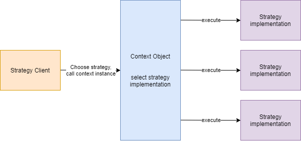
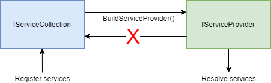

The strategy pattern is a behavioral design pattern which
lets you select an algorithm at runtime.
Rather than implementing it directly, you will end up having multiple code parts
with the same interface, which are completely interchangeable.
This design pattern was invented by the famous GoF back in the '90.

In this article I'd like to show a different implementation of it
using dependency injection and discuss the pros and cons
in contrast to the "classic" implementation.


### Outline
* What is the strategy design pattern?
* What are the usages of it?
* How to implement it in a classic way
* How to implement it with dependency injection

> **Remark**: The full code is available at [GitHub](https://github.com/davidkroell/davidkroell.com/tree/main/content/blogposts/2021/strategy-design-pattern-with-di/src)

## What is the strategy design pattern?

Imagine you are running a restaurant which provides service at the tables
and also meals for delivery.
As a result, you have different efforts
and costs depending on where your customer likes to eat.

At the restaurant you have to wash dishes,
serve plates to the table and clean them up.

When a customer likes to have his menu for delivery, you
have to package it and deliver it to your customers house.

Therefore, you maybe have two different pricing policies:
* Eating at the restaurant
* Takeaway and delivery
* ... maybe many more in the future

This is a perfect use case for the strategy design pattern.

> You can find a more detailed explanation of the strategy design pattern -
also with examples in various languages - at https://refactoring.guru/.
There are also other design patterns explained in much detail at this site.
I totally recommend it to everyone to give it a try.

## Implementation without DI

Let me quickly break down this design pattern in
it's parts so that cou can more easily understand it.



Context object
* Holds a reference to all the strategies
* Executes them via the same interface

```csharp
public class BillCalculatorContext
{
	private readonly Dictionary<string, IBillCalculator> _strategies;

	public BillCalculatorContext(BillCalculatorRestaurantStrategy restaurantStrategy,
								 BillCalculatorDeliveryStrategy deliveryStrategy)
	{
		// all the available strategies
		_strategies = new Dictionary<string, IBillCalculator>
		{
			{"restaurant", restaurantStrategy},
			{"delivery", deliveryStrategy}
		};
	}

	public decimal GetTotalPrice(string strategy, ICollection<Order> orders)
	{
		if(_strategies.TryGetValue(strategy, out var billCalculator))
		{
			// the call to the strategy
			return billCalculator.GetTotalPrice(orders);
		}

		throw new NotSupportedException($"Strategy {strategy} is not supported");
	}
}
```

Strategy client:
* Decides which strategy to use
* Calls the context object

```csharp
public static void Run(bool isDelivery, ICollection<Order> orders)
{
	var billCalculatorContext = new BillCalculatorContext(
		new BillCalculatorRestaurantStrategy(),
		new BillCalculatorDeliveryStrategy());

	var strategy = isDelivery
		? "delivery"
		: "restaurant";
	
	var price = billCalculatorContext.GetTotalPrice(strategy, orders);
	Console.WriteLine($"Total bill is: {price} - calculated with {nameof(StartupClassic)}");
}
```

> A complete explanation with samples can be found here: [Strategy design pattern](https://refactoring.guru/design-patterns/strategy)


## Implementation with DI

> Make sure to understand dependency injection first: https://dev.to/ankitutekar/dependency-injection-the-what-and-whys-240m

Proceeding from the classic implementation,
the so-called `Context object` is now the DI-container.

The strategy decision is handled via this container,
depending on what implementation is supplied in the configuration.

When someone resolves the desired interface you automatically get
the correct implementation.

```csharp
// decision is made based on the value of isDelivery
public static void Run(bool isDelivery, ICollection<Order> orders)
{
	var serviceCollection = new ServiceCollection();

	if (isDelivery)
	{
		serviceCollection.AddSingleton<IBillCalculator, BillCalculatorDeliveryStrategy>();
	}
	else
	{
		serviceCollection.AddSingleton<IBillCalculator, BillCalculatorRestaurantStrategy>();
	}

	var serviceProvider = serviceCollection.BuildServiceProvider();
	var billCalculator = serviceProvider.GetRequiredService<IBillCalculator>();

	var price = billCalculator.GetTotalPrice(orders);
	Console.WriteLine($"Total bill is: {price} - calculated with {nameof(StartupDI)}");
}
```


## Pro's and cons with the Microsoft DI

**Pro** Simple to use and default setup for ASP.NET WebApi nowadays.
Therefore, nearly any major framework is compatible with the
`Microsoft.Extensions.DependencyInjection` NuGet.
This circumstance makes this option very popular and well-known.

**Con** A clear con is that when using this DI-container,
it is not possible to change the strategy decision after
the `IServiceProvider` was built, since Microsoft uses
a two-phased approach (which makes the dependency resolution very fast).



As a result, it's bad for long-running services, but perfectly fine
for short-lived programs like CLIs.

## Summary

> **Remark**: The full code is available at [GitHub](https://github.com/davidkroell/davidkroell.com/tree/main/content/blogposts/2021/strategy-design-pattern-with-di/src)

Works fine if it is a short-lived application with decisions only made once.
Otherwise the "default" implementation works too, as well.

When using other DI-Containers it is still possible to change service registrations
during runtime which is another potential design.

As a third option it's also possible to combine the
classic implementation with DI so the Context object is
not responsible for the strategy instance creation;
but the strategy client still goes through the context object.

As you can see there is no one-size-fits-all solution 
and as always you have to decide on your own which
approach is better for your particular use case.
