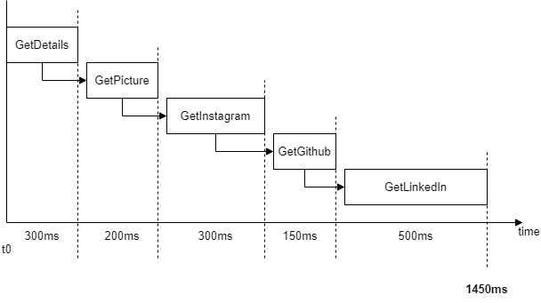
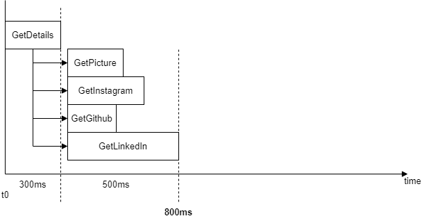

Performance is something every developer cares about.
Even if most of us care about it too early, sooner or later it will impact the user experience if we do not improve performance.
A very crucial part of performance is the latency a user is exposed to.

## TL; DR:
> Use `Task.WhenAll()` to execute tasks in parallel,
if the following task does not depend on a return value of the previous one.
This will reduce latency dramatically - without having to optimize every single code-path (if even possible).

## Example

Imagine a platform which provides profile pages for users.
This platform is able to connect to other social media platforms and load data from there.
An example profile page would look like this:


*An example profile page from a squirrel*

There are different user profile infos printed.
To have the latest data, every time a user accesses this profile page, 
the data is retrieved directly from the third party service.

To retrieve the data, a `ProfileLoader` class is used.
This class returns some dummy data after a specific, artificial delay.
I'll omit the implementation of the details-methods in this post.
The full source code is available as GitHub Gist (see **Conclusion** below).

```csharp
public class ProfileLoader
{
    public async Task<Profile> GetProfileDetailsAsync(string userName)
    {
        var profile = await GetProfileMetaData(userName);

        profile.ProfilePicture = await GetProfilePicture(profile.UserId);
        profile.InstagramDetails = await GetInstagramDetailsAsync(profile.InstagramId);
        profile.GithubDetails = await GetGithubDetailsAsync(profile.GithubId);
        profile.LinkedInDetails = await GetLinkedInDetailsAsync(profile.LinkedInId);

        return profile;
    }
}
```

For this example, I've created a console application which prints the profile details as JSON to the console,
along with how long it took to gather the data.
The elapsed time is measured with the `Stopwatch`.

```csharp
public static async Task Main()
{
    var profileLoader = new ProfileLoader();

    var sw = Stopwatch.StartNew();
    
    var profile = await profileLoader.GetProfileDetailsAsync("TheAwesomeSquirrel");

    Console.WriteLine($"Profile details retrieved, took {sw.ElapsedMilliseconds}ms");

    Console.WriteLine(JsonSerializer.Serialize(profile, new JsonSerializerOptions
    {
        WriteIndented = true
    }));

    // Output: 
    // Profile details retrieved, took 1528ms
    // ...
}
```

According to the code above, the tasks are executed in an asynchronous manner, but still one after another.
The thread does not block (because it is async) but the execution is not parallel either.



*These are the steps executed one after another. The numbers on the x-axis are the artificial delays.*

Every `await` schedules a thread on the thread pool and waits for the result.
After the method returns, the thread continues in the original method.
In the diagram above, you can see how the execution is done.
Every subsequent task does not start before the current one has completed.

This is the part which can be optimized easily with `Task.WhenAll()`.
Task.WhenAll() allows us to start all tasks at the same time and
wait until every single task has completed it's operation.

No task therefore delays the execution of another one.



*These are the steps executed in parallel. The numbers on the x-axis are the artificial delays.*


Below is the new implementation of the `ProfileLoader`.
All the methods which are called in here to get the details **were not touched**.

```csharp
public class ProfileLoader
{   
    public async Task<Profile> GetProfileDetailsFastAsync(string userName)
    {
        var profile = await GetProfileMetaData(userName);

        var profilePictureTask = GetProfilePicture(profile.UserId);
        var instagramDetailsTask = GetInstagramDetailsAsync(profile.InstagramId);
        var githubDetailsTask = GetGithubDetailsAsync(profile.GithubId);
        var linkedInDetailsTask = GetLinkedInDetailsAsync(profile.LinkedInId);

        // start all tasks in parallel and wait until all are completed
        await Task.WhenAll(profilePictureTask, instagramDetailsTask, githubDetailsTask, linkedInDetailsTask);

        // await does not wait here, because tasks are already completed
        profile.ProfilePicture = await profilePictureTask;
        profile.InstagramDetails = await instagramDetailsTask;
        profile.GithubDetails = await githubDetailsTask;
        profile.LinkedInDetails = await linkedInDetailsTask;
        
        return profile;
    }
}

public static async Task Main()
{
    var profileLoader = new ProfileLoader();

    var sw = Stopwatch.StartNew();
       
    var profileFast = await profileLoader.GetProfileDetailsFastAsync("TheAwesomeSquirrel");

    System.Console.WriteLine($"Profile details retrieved, took {sw.ElapsedMilliseconds}ms");

    System.Console.WriteLine(JsonSerializer.Serialize(profileFast, new JsonSerializerOptions
    {
        WriteIndented = true
    }));

    // Output: 
    // Profile details retrieved, took 833ms
    // ...
}
```

As you can see, the total execution is much faster now.
Still every method has it's artificial delay, but since it's
now running in parallel, the total delay is much lower. 
Also the overhead compared to when awaiting every task one after another is lower.
Before, the overhead (in addition to the artifical delays) was 78ms, now it is reduced to 33ms.


## Conclusion

Only by optimizing how tasks are awaited, a lot of performance can be gained.
This is possible when method return values do not depend upon another one.
Also the overhead in awaiting the tasks is reduced.

> Note: The `WhenAll()` also has an overload which returns the result:
`WhenAll<TResult>(IEnumerable<Task<TResult>>)`.
When all of your provided tasks have the same result type, an
array of results is returned, which you can then use to combine
all of them together.

Have you ever used `Task.WhenAll()` to improve the performance of your app?

You can view the whole source code on my [GitHub](
https://github.com/davidkroell/davidkroell.com/tree/main/content/blogposts/2022/boost-async-code-in-csharp/src/).

