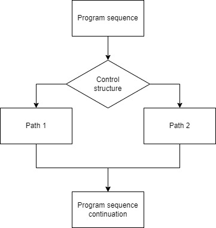
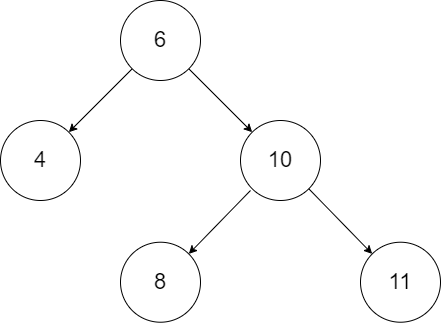

C# does support multiple control structures such as `if`, `else`, `switch`, `while`, `for` (and some more).
With a control structure you can split your code in multiple possible paths, based on a codition.




*A general graphical representation of a control structure*

The `if` and `switch` statements are very well-known and adopted in most programming languages nowadays.
They are also often applied for the same use-case.

# The experiment

Given a three-digit string of month names, like `Jan`, `Feb`, `Mar`, ... we want to get the corresponding month number as integer.
The results would be: `Jan = 1`, `Feb = 2`, `Mar = 3` and so on.

### The if-implementation

This is the baseline implementation with `if` and `return`.

```csharp
private int GetMonthIndexIf(string month)
{
    if (month == "Jan")
    {
        return 1;
    }

    if (month == "Feb")
    {
        return 2;
    }

    if (month == "Mar")
    {
        return 3;
    }
    // and so on
}
```

### The switch-implementation

This is the equivalent implementation with a `switch` statement.

```csharp
private int GetMonthIndexSwitch(string month)
{
    return month switch
    {
        "Jan" => 1,
        "Feb" => 2,
        "Mar" => 3,
        "Apr" => 4,
        "May" => 5,
        "Jun" => 6,
        "Jul" => 7,
        "Aug" => 8,
        "Sep" => 9,
        "Okt" => 10,
        "Nov" => 11,
        "Dez" => 12,
        _     => throw new ArgumentException(),
    };
}
```

> The syntax used above is called a **switch expression**.
This is available since C# 8.0, see: [MSDN Docs](https://docs.microsoft.com/en-us/dotnet/csharp/language-reference/operators/switch-expression)

### The Dictionary-implementation

For reference, I've also created an implementation based on a `Dictionary<string, int>`.

```csharp
private int GetMonthIndexDictionary(string month)
{
    // _monthsDict maps the month name to the index
    return _monthsDict[month];
}
```


## Benchmark setup

I'm using `BenchmarkDotNet` for running the benchmarks.
For every `GetMonthIndex*` method, all months from `Jan` to `Dez` are called `N` times,
to cover every path of these methods.
The benchmark is executed three times, for `N=1, 10, 100`.


## Benchmark results


```bash
BenchmarkDotNet=v0.13.1, OS=Windows 10.0.19044.1645 (21H2)
Intel Core i7-8650U CPU 1.90GHz (Kaby Lake R), 1 CPU, 8 logical and 4 physical cores
.NET SDK=6.0.104
  [Host]     : .NET 6.0.4 (6.0.422.16404), X64 RyuJIT
  DefaultJob : .NET 6.0.4 (6.0.422.16404), X64 RyuJIT


|                   Method |   N |        Mean |     Error |    StdDev |
|------------------------- |---- |------------:|----------:|----------:|
|     GetMonthIndex_Switch |   1 |    173.7 ns |   0.77 ns |   0.72 ns |
|         GetMonthIndex_If |   1 |    485.6 ns |   3.13 ns |   2.78 ns |
| GetMonthIndex_Dictionary |   1 |    325.8 ns |   1.70 ns |   1.42 ns |
|     GetMonthIndex_Switch |  10 |    960.9 ns |   5.56 ns |   5.20 ns |
|         GetMonthIndex_If |  10 |  2,528.3 ns |  15.35 ns |  14.36 ns |
| GetMonthIndex_Dictionary |  10 |  1,793.8 ns |  25.68 ns |  22.77 ns |
|     GetMonthIndex_Switch | 100 |  8,211.9 ns |  68.39 ns |  53.40 ns |
|         GetMonthIndex_If | 100 | 26,460.3 ns | 513.94 ns | 990.18 ns |
| GetMonthIndex_Dictionary | 100 | 17,662.1 ns | 286.67 ns | 254.13 ns |
```

As you can above, the `GetMonthIndex_Switch` is the fastest,
`GetMonthIndex_Dictionary` ranks on the second place,
and `GetMonthIndex_If` is the slowest.

> Mind that these are nanoseconds (!) it won't effect your application
performance very much.

Now why is `switch` faster than `if`?


## The switch statement distilled

In fact, the switch statement does not exist in C#.
There is a step in the compilation of C#,
which rewrites switch statements to if-statements.
This step is called **lowering**.
It translates high-level language features to low-level language features.

> You can [read more about it here](https://mattwarren.org/2017/05/25/Lowering-in-the-C-Compiler/).
You will also notice that this is very widely used.


With [sharplab.io](https://sharplab.io/) you can see the C#-code which is produced during lowering.
When we paste our original `GetMonthIndexSwitch` in there,
you will see that this is rewritten into `if` statements.


```csharp
private int GetMonthIndexSwitch(string month)
{
    uint num = <PrivateImplementationDetails>.ComputeStringHash(month);
    if (num <= 1118301483)
    {
        if (num <= 749839599)
        {
            if (num != 566134113)
            {
                if (num != 663571330)
                {
                    if (num == 749839599 && month == "Sep")
                    {
                        return 9;
                    }
                }
                else if (month == "Feb")
                {
                    return 2;
                }
            }
            else if (month == "Okt")
            {
                return 10;
            }
        }
        else if (num != 1000858150)
        {
            if (num != 1046388392)
            {
                if (num == 1118301483 && month == "Mar")
                {
                    return 3;
                }
            }
            else if (month == "Dez")
            {
                return 12;
            }
        }
        else if (month == "May")
        {
            return 5;
        }
    }
    else if (num <= 1190317742)
    {
        if (num != 1153511100)
        {
            if (num != 1187066338)
            {
                if (num == 1190317742 && month == "Jan")
                {
                    return 1;
                }
            }
            else if (month == "Jun")
            {
                return 6;
            }
        }
        else if (month == "Jul")
        {
            return 7;
        }
    }
    else if (num != 2213879282u)
    {
        if (num != 2319303684u)
        {
            if (num == 2699988948u && month == "Aug")
            {
                return 8;
            }
        }
        else if (month == "Nov")
        {
            return 11;
        }
    }
    else if (month == "Apr")
    {
        return 4;
    }
    throw new ArgumentException();
}
```

Compared to our solution with the if-statements,
it produces the same output but works in a whole different way.

Instead of going through all cases, it builds up a tree-like structure.
This is where the performance gain comes.
It's just faster when you look for a match in a tree-structure,
than to look for a match when iterating all possible cases.
Below you can see an example of a tree-structure.

> The compiler only rewrites it into a tree-structure if there are enough possible cases.
When there are less than seven cases, no tree-structure is built.



*An example tree structure. This does not match the code generated during lowering seen above*

## Summary

* Switch statements are rewritten by the compiler to if-statements.
Due to the rewriting into a tree-structure, it gets faster the more cases are.
* There are many other high-level language features
which are rewritten during the lowering step in the compilation.
* In this scenario with 12 cases, `if` is the slowest, the `dictionary` ranks second
and the `switch` is the fastest.
Nevertheless, it probably won't affect your application's performance.

