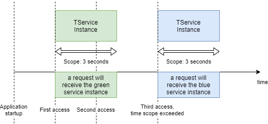

The Microsoft Dependency Injection (DI) container provides three different types of registrations.

* Transient
* Scoped
* Singleton

A `Transient` registration will always create a new instance of a service when requested.
When registered as `Scoped`, there will be a single instance within a scope.
A scope can be anything and is created via the [`IServiceProvider.CreateScope()`](https://docs.microsoft.com/en-us/dotnet/api/microsoft.extensions.dependencyinjection.serviceproviderserviceextensions.createscope?view=dotnet-plat-ext-6.0)
extension method.
For example, in ASP.NET every HTTP request has it's own scope.
The last type is the `Singleton` (a GoF design pattern), this resolves always the same instance, as the name suggests.


These days I wanted to have a DI registration which will be time-scoped.
As such, it will return a new instance, if the time in which it is valid runs out.
You can think of it like a *best-before date*.

The reference time should be the time, when it is accessed (created) first.



*A diagram on how a resolve of a service should work and when there are fresh instances created*


## Usage

Install the package `DavidKroell.TimeScoped` into your projects - it is available
from [NuGet.org](https://www.nuget.org/packages/DavidKroell.TimeScoped/).

With `AddTimeScoped<TSerice>` you can add a time-scoped service to the DI container.
You can then resolve the time-scoped service as a generic interface: `ITimeScoped<DummyService>`
This interface has a single property - `Instance` - which will be your real service.

```cs
var sc = new ServiceCollection();

sc.AddTimeScoped<DummyService>(TimeSpan.FromSeconds(3));

var provider = sc.BuildServiceProvider();

var timeScopedService = provider.GetRequiredService<ITimeScoped<DummyService>>();

var instance1 = timeScopedService.Instance;

await Task.Delay(5000);

// should return a new instance, because 3 seconds are over
var instance2 = timeScopedService.Instance;

Assert.AreNotSame(instance1, instance2);
```

> Never store an instance of your real service in an variable!
You should always access it within the wrapper class.


## Implementation

The implementation of this is pretty simple.
The main logic is all within the `Instance` getter method.


```cs
internal class TimeScopedProvider<TService> : ITimeScoped<TService> where TService : class
{
    private readonly IServiceProvider _provider;
    private readonly TimeSpan _validTimeSpan;
    private DateTime? _validUntil;
    private TService? _instance;
    public TService Instance => GetInstance();

    public TimeScopedProvider(IServiceProvider provider, TimeSpan validTimeSpan)
    {
        _provider = provider;
        _validTimeSpan = validTimeSpan;
    }

    private TService GetInstance()
    {
        if (_validUntil == null || _validUntil < DateTime.Now)
        {
            lock (this)
            {
                CleanupOldInstance();

                _instance = (TService) _provider.GetService(typeof(TService))!;

                _validUntil = DateTime.Now.Add(_validTimeSpan);
            }
        }

        return _instance!;
    }

    private void CleanupOldInstance()
    {
        if (_instance is IDisposable disposable)
        {
            disposable.Dispose();
        }

        _instance = null;
    }
}
```

## Summary

You can use this implementation when you want a new instance from time to time,
but not for every access.
I've once used it for a simple cache implementation.

